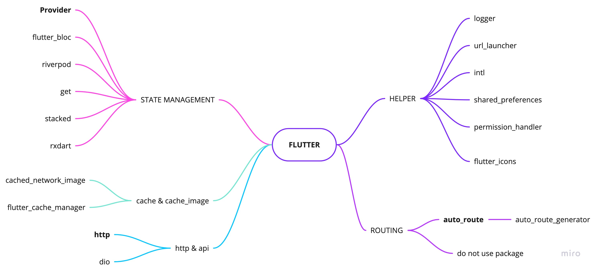
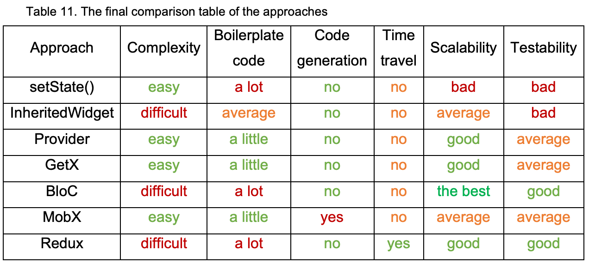

# Flutter boilerplate

<p align="center">
  <a href="https://flutter.io/">
    
  </a>

  <h3 align="center">Flutter Boilerplate Project</h3>

  <p align="center">
    Fork this project then start you project with a lot of stuck prepare
    <br>
    Base project made with much  :heart: . Contains CRUD, patterns, and much more!
    <br>
    <br>
    <a href="https://github.com/j1mmyto9/flutter-boilerplate/issues/new">Report bug</a>
    ·
    <a href="https://github.com/j1mmyto9/flutter-boilerplate/issues/new">Request feature</a>
  </p>
</p>

## Table of contents

- [How to Use](#how-to-use)
- [Code Conventions](#code-conventions)
- [Dependencies](#depencencies)
- [Code structure](#code-structure)

## How to Use 

1. Download or clone this repo by using the link below:
  ```
  https://github.com/j1mmyto9/flutter-boilerplate.git
  ```
2. Go to project root and execute the following command in console to get the required dependencies: 

  ```
  flutter pub get 
  ```
3. Now run the generator
  ```
  flutter packages pub run build_runner build
  ```

# Code Conventions
- [analysis_options.yaml](analysis_options.yaml)
- [about code analytis flutter](https://medium.com/flutter-community/effective-code-in-your-flutter-app-from-the-beginning-e597444e1273)

In Flutter, Modularization will be done at a file level. While building widgets, we have to make sure they stay independent and re-usable as maximum. Ideally, widgets should be easily extractable into an independent project.


# Depencencies

 

## Helper
- [logger](https://pub.dev/packages/logger): Small, easy to use and extensible logger which prints beautiful logs.
- [url_launcher](https://pub.dev/packages/url_launcher): A Flutter plugin for launching a URL in the mobile platform. Supports iOS, Android, web, Windows, macOS, and Linux.
- [auto_route](https://pub.dev/packages/auto_route): Auto route generator, Manager router
- [get](https://pub.dev/packages/get): Snackbar, Navigation, Theme, Hellper function

- [intl](https://pub.dev/packages/intl): This package provides internationalization and localization facilities, including message translation, plurals and genders, date/number formatting and parsing, and bidirectional text.
- [shared_preferences](https://pub.dev/packages/shared_preferences): Flutter plugin for reading and writing simple key-value pairs. Wraps NSUserDefaults on iOS and SharedPreferences on Android.

- [package_info](https://pub.dev/packages/package_info)
- [device_info](https://pub.dev/packages/device_info)
- [permission_handler](https://pub.dev/packages/permission_handler): Permission plugin for Flutter. This plugin provides a cross-platform (iOS, Android) API to request and check permissions.

## HTTP, API
- [http](https://pub.dev/packages/http): A composable, Future-based library for making HTTP requests.


## Flutter Fire
The official Firebase plugins for Flutter. sign_in, analytics, crashlytics, storage, firestore
- [Flutter Fire](https://firebase.flutter.dev/)

## State Management
State Management is still the hottest topic in Flutter Community. There are tons of choices available and it’s super intimidating for a beginner to choose one. Also, all of them have their pros and cons. So, what’s the best approach

 

- [provider](https://pub.dev/packages/provider): **A recommended approach**

**Other favorite package**
- [rxdart](https://pub.dev/packages/rxdart): RxDart adds additional capabilities to Dart Streams and StreamControllers. Using as bloc pattens
- [flutter_bloc](https://pub.dev/packages/flutter_bloc): Widgets that make it easy to integrate blocs and cubits into Flutter. [Learn more](https://bloclibrary.dev/#/) 
- [RiverPod](https://pub.dev/packages/riverpod): This project can be considered as a rewrite of provider to make improvements that would be otherwise impossible.
- [Get](https://pub.dev/packages/get): A simplified reactive state management solution.
- [stacked](https://pub.dev/packages/stacked): This architecture was initially a version of MVVM.
- [get](https://pub.dev/packages/get): Getx Ecosystem (State, Router, Dependency management, Theme, Utils)

- [More about state management](https://flutter.dev/docs/development/data-and-backend/state-mgmt/options)

## Flutter Gen
- [flutter_gen](https://pub.dev/packages/flutter_gen): The Flutter code generator for your assets, fonts, colors, … — Get rid of all String-based APIs.

## Widget
- [shimmer](https://pub.dev/packages/shimmer): Shimmer loading animation
- [flutter_html](https://pub.dev/packages/flutter_html)
- [webview_flutter](https://pub.dev/packages/webview_flutter)

## Image
- [cached_network_image](https://pub.dev/packages/cached_network_image)
- [flutter_cache_manager](https://pub.dev/packages/flutter_cache_manager)

## Other favorite package
- [DIO](https://pub.dev/packages/dio): A powerful Http client for Dart
- [hive](https://pub.dev/packages/hive), [sqflite](https://pub.dev/packages/sqflite): Flutter plugin for reading and locale data

# Code structure
Here is the core folder structure which flutter provides.
```
flutter-app/
|- android
|- ios
|- lib
|- modules
|- test
```
Here is the folder structure we have been using in this project

```
lib/
|- _dev/
  |- mock/
  |- view/
  |- widget/

|- packages/
|- src/
  |- data/
  |- services/
  |- feature/
    |- dashboard/
      |- widget/
      |- controller
      |- dashboard_screen.dart
    |- home/
    |- login/
  |- plugins/
  |- routing/
|- widgets/
  |- button/
  |- image/
  |- view/
|- main.dart
|- modules
```

## Wiki
Checkout [wiki](https://github.com/j1mmyto9/flutter-boilerplate/wiki) for more info

