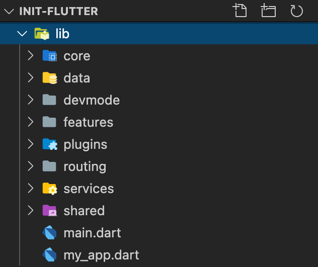

# Flutter boilerplate

<p align="center">
  <a href="https://flutter.io/">
    
  </a>

  <h3 align="center">Flutter Boilerplate Project</h3>

  <p align="center">
    Fork this project then start you project with a lot of stuck prepare
    <br>
    Base project made with much  :heart: . Contains CRUD, patterns, and much more!
    <br>
    <br>
    <a href="https://github.com/PingAK9/init-flutter/issues/new">Report bug</a>
    ·
    <a href="https://github.com/PingAK9/init-flutter/issues/new">Request feature</a>
  </p>
</p>

## Table of contents

- [How to Use](#how-to-use)
- [Code Conventions](#code-conventions)
- [Depencencies](#depencencies)
- [Code structure](#code-structure)

## How to Use 

**Step 1:**

Download or clone this repo by using the link below:

```
https://github.com/PingAK9/init-flutter.git
```

**Step 2:**

Go to project root and execute the following command in console to get the required dependencies: 

```
flutter pub get 
```

**Step 3:**

This project uses `inject` library that works with code generation, execute the following command to generate files:

```
flutter packages pub run build_runner build --delete-conflicting-outputs
```

or watch command in order to keep the source code synced automatically:

```
flutter packages pub run build_runner watch
```

## Hide Generated Files

In-order to hide generated files, navigate to `Android Studio` -> `Preferences` -> `Editor` -> `File Types` and paste the below lines under `ignore files and folders` section:

```
*.inject.summary;*.inject.dart;*.g.dart;
```

In Visual Studio Code, navigate to `Preferences` -> `Settings` and search for `Files:Exclude`. Add the following patterns:
```
**/*.inject.summary
**/*.inject.dart
**/*.g.dart
```

# Code Conventions
- [analysis_options.yaml](analysis_options.yaml)
- [about code analytis flutter](https://medium.com/flutter-community/effective-code-in-your-flutter-app-from-the-beginning-e597444e1273)

In Flutter, Modularization will be done at a file level. While building widgets, we have to make sure they stay independent and re-usable as maximum. Ideally, widgets should be easily extractable into an independent project.


# Depencencies

 

## Helper
- [logger](https://pub.dev/packages/logger): Small, easy to use and extensible logger which prints beautiful logs.
- [url_launcher](https://pub.dev/packages/url_launcher): A Flutter plugin for launching a URL in the mobile platform. Supports iOS, Android, web, Windows, macOS, and Linux.
- [auto_route](https://pub.dev/packages/auto_route): Auto route generator, Manager router
- [get](https://pub.dev/packages/get): Snackbar, Navigation, Theme, Hellper function

- [intl](https://pub.dev/packages/intl): This package provides internationalization and localization facilities, including message translation, plurals and genders, date/number formatting and parsing, and bidirectional text.
- [shared_preferences](https://pub.dev/packages/shared_preferences): Flutter plugin for reading and writing simple key-value pairs. Wraps NSUserDefaults on iOS and SharedPreferences on Android.

`Other`: [hive](https://pub.dev/packages/hive), [sqflite](https://pub.dev/packages/sqflite)
- [package_info](https://pub.dev/packages/package_info)
- [device_info](https://pub.dev/packages/device_info)
- [permission_handler](https://pub.dev/packages/permission_handler): Permission plugin for Flutter. This plugin provides a cross-platform (iOS, Android) API to request and check permissions.

## HTTP, API
- [http](https://pub.dev/packages/http): A composable, Future-based library for making HTTP requests.

Besides, you can use one of the favorite package [DIO](https://pub.dev/packages/dio)

## Flutter Fire
The official Firebase plugins for Flutter. sign_in, analytics, crashlytics, storage, firestore
- [Flutter Fire](https://firebase.flutter.dev/)

## State Management

State Management is still the hottest topic in Flutter Community. There are tons of choices available and it’s super intimidating for a beginner to choose one. Also, all of them have their pros and cons. So, what’s the best approach

- [provider](https://pub.dev/packages/provider): **A recommended approach.
Other recommend**

Other favorite package
- [rxdart](https://pub.dev/packages/rxdart): RxDart adds additional capabilities to Dart Streams and StreamControllers. Using as bloc pattens
- [flutter_bloc](https://pub.dev/packages/flutter_bloc): Widgets that make it easy to integrate blocs and cubits into Flutter. [Learn more](https://bloclibrary.dev/#/) 
- [RiverPod](https://pub.dev/packages/riverpod): This project can be considered as a rewrite of provider to make improvements that would be otherwise impossible.
- [Get](https://pub.dev/packages/get): A simplified reactive state management solution.
- [stacked](https://pub.dev/packages/stacked): This architecture was initially a version of MVVM. 

 

- [More about state management](https://flutter.dev/docs/development/data-and-backend/state-mgmt/options)

## Get package 
[get](https://pub.dev/packages/get)

- Utils
- Theme
- [State management](https://medium.com/flutter-community/the-flutter-getx-ecosystem-state-management-881c7235511d)
- [Router management](https://pub.dev/packages/get#route-management)
- [Dependency management](https://medium.com/flutter-community/the-flutter-getx-ecosystem-dependency-injection-8e763d0ec6b9)


## Flutter Gen
- [flutter_gen](https://pub.dev/packages/flutter_gen): The Flutter code generator for your assets, fonts, colors, … — Get rid of all String-based APIs.

## Widget
- [shimmer](https://pub.dev/packages/shimmer): Shimmer loading animation
- [flutter_html](https://pub.dev/packages/flutter_html)
- [webview_flutter](https://pub.dev/packages/webview_flutter)

## Image
- [cached_network_image](https://pub.dev/packages/cached_network_image)
- [flutter_cache_manager](https://pub.dev/packages/flutter_cache_manager)


# Code structure
Here is the core folder structure which flutter provides.
```
flutter-app/
|- android
|- ios
|- lib
|- modules
|- test
```
Here is the folder structure we have been using in this project

```
lib/
|- code/
|- data/
|- _devmode/
  |- mock/
  |- view/
  |- widget/
|- services/
|- feature/
  |- dashboard/
    |- widget/
    |- controller
    |- dashboard_screen.dart
  |- home/
  |- login/
|- plugins/
|- routing/
|- shared/
  |- widget/
  |- controller/
  |- models/
  |- view/
|- main.dart
|- modules
```

Here is the folder structure of core modules in this project

```
ping9/
|- code/
|- dialog/
|- theme/
|- widget/
|- view/
```

Now, lets dive into the lib folder which has the main code for the application.


## Theme 
If our application supports light and dark theme and these themes are custom themes. We will be adding all the colors which are needed for each widget type. One more file we will be creating theme_config.dart which describes all the constants related to the theme.

There are 2 thing we need custom for each theme.
We need to create two files light_theme.dart, dark_theme.dart where we will be adding all the colors which are needed for each widget type
- **ThemeData (styles)**: fontFamily, primaryColor, brightness, textTheme, inputDecorationTheme, buttonTheme
- **ColorScheme**: Create extension for **ColorScheme** to add any custom color for Dark and Light mode. So it will update widget when you change theme run-time 


### Config
This directory contains/Config all the application level constants. A separate file is created for each type as shown in example below:
- **assest_path.dart**: Although we have described the assets path in pubspec.yaml but to use that asset in an application we need to give there relative path in any widgets.
If we add all the assets relative path in one file then it will be easy for us to get all the paths and update the path if required in the future.
- **app_constants.dart**: This is where all our application constants will be present and this is different for each application.

Here is how the constants folder looks like:
```
Config/
|- constants.dart
|- app_config.dart
|- device_info.dart
|- preferences.dart
|- content.dart
```

### Routes

This file contains all the routes for your application.
Using auto_router to generator Route setting and Router 

```dart
import 'package:flutter/material.dart';

import 'ui/home/home.dart';
import 'ui/login/login.dart';
import 'ui/splash/splash.dart';

class Routes {
  Routes._();

  //static variables
  static const String splash = '/splash';
  static const String login = '/login';
  static const String home = '/home';

  static final routes = <String, WidgetBuilder>{
    splash: (BuildContext context) => SplashScreen(),
    login: (BuildContext context) => LoginScreen(),
    home: (BuildContext context) => HomeScreen(),
  };
}
```

If you're working with only one navigator
```
ExtendedNavigator.root.push(..)
```
Using context for stack navigator
```
ExtendedNavigator.of(context).push(...)
// or
context.navigator.push(...)
context.rootNavigator.push(...)
// give your navigator a name
ExtendedNavigator(router: Router(), name: "nestedNav")
//call it by its name
ExtendedNavigator.named("nestedNav").push(...)
```
More information - [auto_route](https://pub.dev/packages/auto_route)

### Services
All the business logic of your application will go into this directory, it represents the data layer of your application. It is sub-divided into three directories `local`, `network` and `shared_perf`, each containing the domain specific logic. Since each layer exists independently, that makes it easier to unit test. The communication between UI and data layer is handled by using central repository.
```
Services/
|- analytics_service.dart
|- authentication_service.dart
|- cloud_storage_service.dart
|- dialog_service.dart
|- firestore_service.dart
|- google_service.dart
|- shared_preference_service.dart
|- theme_service.dart
|- user_service.dart
```

Using **dependency injection** pattern to manager all the services. 
```
void setupLocator() {
  Get.lazyPut(() => DialogService());
  Get.lazyPut(() => UserService());
  Get.lazyPut(() => AuthenticationService());
  Get.lazyPut(() => FirestoreService());
  Get.lazyPut(() => UserDefaults());
  Get.lazyPut(() => CloudStorageService());
  Get.lazyPut(() => ThemeService());
  Get.lazyPut(() => TabBarViewModel());
  Get.lazyPut(() => ConstantData());
}
```

### Feature
Split app to feature. All the modules and core features should contain these four folders to separate out the business logic from the UI.

```
|- feature/
  |- dashboard/
    |- widget/
    |- controller
    |- dashboard_screen.dart
  |- home/
  |- login/
```

### UI/Widgets

Contains the common widgets that are shared across multiple screens. For example, Button, TextField etc.

```
widgets/
|- form
|- block
|- button
| - ...
```

### viewmodels

The store is where all your application state lives in flutter. The Store is basically a widget that stands at the top of the widget tree and passes it's data down using special methods. In-case of multiple stores, a separate folder for each store is created as shown in the example below:

```
viewmodels/
|- player-viewmodel
|- manager-viewmodel
|- rating-viewmodel
|- login-viewmodel
|- user-viewmodel
|- squad-viewmodel
```

- FeatureNameScreen.dart
- Controller/ `This folder contains the repository files which is used to write code for services call and for state management.` Recommendation using **provider** > **bloc pattern (rxdart)**
- Widget/ `This folder consists of all the screens UI widgets that will be visible to the user.`
- Models/ `This folder contains the data models which need to be shown on the dashboard screen.`

### Main

This is the starting point of the application. All the application level configurations are defined in this file i.e, theme, routes, title, orientation etc.
Using Get package for theme, navigation, snackbar ...

- Init, Setup before run App
```dart

Future main() async{
  WidgetsFlutterBinding.ensureInitialized();
  await Firebase.initializeApp()
  setupLocator();
  await AppConfig.instance.appSetup(BuildFlavor.development);
  runApp(MyApp());
}
```

- Run App with **MaterialApp** wrapper
If you using **Get** package you should setup with **GetMaterialApp**
Also need setup too: Toash, Theme, DialogService, Router, localizations

```dart
class MyApp extends StatelessWidget {
  // This widget is the root of your application.
  @override
  Widget build(BuildContext context) {
    return MaterialApp(
      debugShowCheckedModeBanner: false,
      title: Strings.appName,
      theme: themeData,
      routes: Routes.routes,
      home: SplashScreen(),
    );
  }
}
```

You code structure look like
 

## Wiki
Checkout [wiki](https://github.com/PingAk9/init-flutter/wiki) for more info

