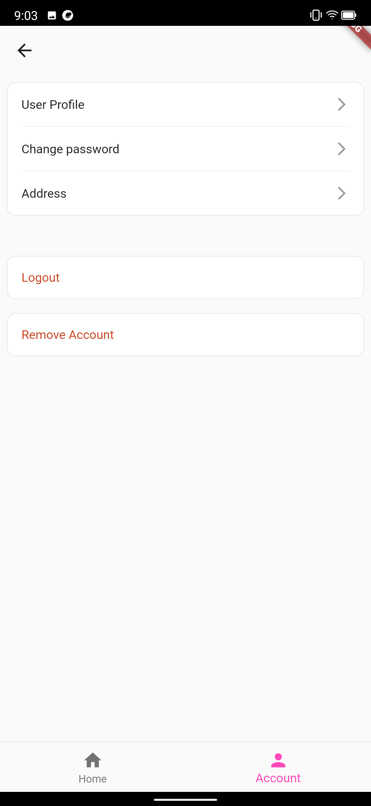

# Flutter Boilerplate

<p align="center">
  <a href="https://flutter.io/">
    
  </a>

  <!-- <h3 align="center">Flutter Boilerplate Project</h3> -->

  <p align="center">
    Fork this project then start you project with a lot of stuck prepare
    <br>
    Base project made with much  :heart: . Contains CRUD, patterns, and much more!
    <br>
    <br>
    <a href="https://github.com/j1mmyto9/flutter-boilerplate/issues/new">Report bug</a>
    ·
    <a href="https://github.com/j1mmyto9/flutter-boilerplate/issues/new">Request feature</a>
  </p>
</p>

## Table of contents

- [Prerequisites](#prerequisites)
- [How to Run](#how-to-run)
- [Using This Template](#using-this-template)
- [Code Conventions](#code-conventions)
- [Dependencies](#dependencies)
- [Code Structure](#code-structure)
- [Navigation Stack](#navigation-stack)
- [Wiki](#wiki)
- [Screenshots](#screenshots)

---

## Prerequisites

- **Flutter:** `>=3.35.3`
- **Firebase Projects:**
  - [Firebase Staging](https://console.firebase.google.com/u/0/project/flutter-app-ec8dd/settings/iam)
  - [Firebase Production](https://console.firebase.google.com/u/0/project/template-app-prod-3a034/settings/iam)

---

## How to Run

1. **Clone the repo:**

   ```sh
   git clone https://github.com/khanhuitse05/flutter-boilerplate.git
   ```

2. **Install dependencies:**

   ```sh
   flutter pub get
   ```

3. **Generate code:**

   ```sh
   flutter packages pub run build_runner build
   ```

4. **Run the app (Staging):**

   ```sh
   flutter run --flavor staging --target lib/main_staging.dart
   ```

5. **Run the app (Production):**

   ```sh
   flutter run --flavor production --target lib/main_production.dart
   ```

---

## Using This Template

1. **Clone this repo:**

   ```sh
   git clone https://github.com/khanhuitse05/flutter-boilerplate.git
   ```

2. **Customize the package name:**

   ```sh
   sudo sh ./customizer.sh your.package.name
   ```

   ✅ This will:
   - Remove the existing git history  
   - Update the README  
   - Change your bundle ID  

3. **Update your Firebase config:**

   - **Android**
     - `android/app/src/staging/google-services.json`
     - `android/app/src/production/google-services.json`
   - **iOS**
     - `ios/config/GoogleService-Info.plist` (staging & production)
   - Update:
     - `firebase_options_stg.dart`
     - `firebase_options_prod.dart`
     - `REVERSED_CLIENT_ID` in `Info.plist`

4. **Regenerate Firebase options:**

   ```sh
   flutterfire config      --project={YOUR_FIREBASE_PROJECT_ID}      --out={PATH_TO_SAVE/firebase_options.dart}      --ios-bundle-id={BUNDLE_ID_APP}      --android-app-id={APP_ID}
   ```

   → [Read More in the Wiki](https://github.com/khanhuitse05/flutter-boilerplate/wiki/Flavors)

5. **Run the app:** [Follow steps here](#how-to-run)

---

## Code Conventions

- [analysis_options.yaml](analysis_options.yaml)
- [Effective Code in Flutter](https://medium.com/flutter-community/effective-code-in-your-flutter-app-from-the-beginning-e597444e1273)

**Best Practices:**

- Modularize widgets to be as independent and reusable as possible.
- Follow naming conventions:
  - **Models:** start with `M` → `MUser`, `MProduct`, `MGroup`
  - **Common Widgets:** start with `X` → `XButton`, `XText`, `XAppBar` (stored in `lib/widgets/`)
  - **App Constants/Services:** start with `App` → `AppStyles`, `AppColor`, `AppRouter`, `AppCoordinator`, `UserPrefs`

---

## Dependencies


### Helpers

- [logger](https://pub.dev/packages/logger) – Pretty logging
- [url_launcher](https://pub.dev/packages/url_launcher) – Launch URLs
- [auto_route](https://pub.dev/packages/auto_route) – Router generator
- [get_it](https://pub.dev/packages/get_it) – Service Locator
- [intl](https://pub.dev/packages/intl) – i18n, formatting
- [shared_preferences](https://pub.dev/packages/shared_preferences) – Key-value storage
- [package_info_plus](https://pub.dev/packages/package_info_plus) – App package info
- [device_info_plus](https://pub.dev/packages/device_info_plus) – Device info
- [permission_handler](https://pub.dev/packages/permission_handler) – Permission management

### HTTP / API

- [http](https://pub.dev/packages/http) – HTTP requests

### Firebase

- [FlutterFire](https://firebase.flutter.dev/) – Auth, Analytics, Crashlytics, Storage, Firestore

### State Management

- [flutter_bloc](https://pub.dev/packages/flutter_bloc) – Recommended BLoC pattern [Docs](https://bloclibrary.dev/#/)

### Assets / Code Generation

- [flutter_gen](https://pub.dev/packages/flutter_gen) – Strongly typed assets, fonts, colors

### Localization

- [localization](https://pub.dev/packages/localization) – Simplified translations

### Widgets

- [shimmer](https://pub.dev/packages/shimmer) – Loading shimmer effect
- [flutter_html](https://pub.dev/packages/flutter_html)
- [webview_flutter](https://pub.dev/packages/webview_flutter)

### Image & Cache

- [cached_network_image](https://pub.dev/packages/cached_network_image)
- [flutter_cache_manager](https://pub.dev/packages/flutter_cache_manager)

---

## Code Structure

### Default Flutter Structure

```
flutter-app/
|- android
|- ios
|- web
|- lib
|- modules
|- test
```

### Project Structure Used

```
lib/
|- packages/
|- src/
  |- data/
  |- services/
  |- feature/
    |- dashboard/
      |- widget/
      |- controller/
      |- dashboard_screen.dart
    |- home/
    |- login/
  |- plugins/
  |- routing/
|- widgets/
  |- button/
  |- image/
  |- view/
|- main.dart
|- modules/
```

---

## Navigation Stack


---

## Wiki

Check out the [Wiki](https://github.com/khanhuitse05/flutter-boilerplate/wiki) for more detailed guides.

---

## Screenshots

| Account | Profile | Login |
| ------ | ------- | ----- |
|  |  |  |
